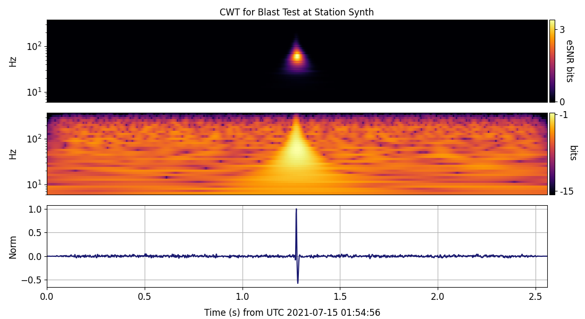
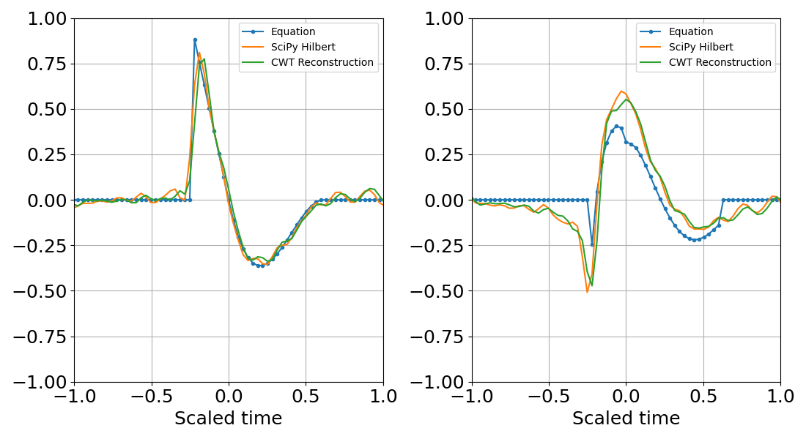
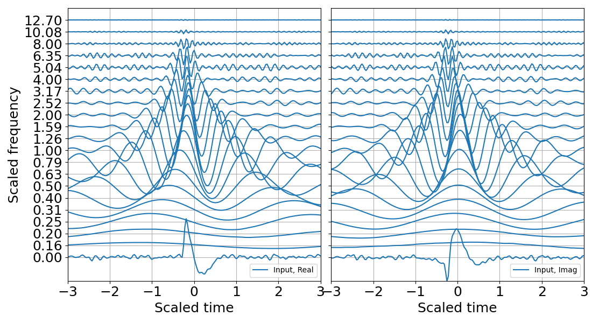
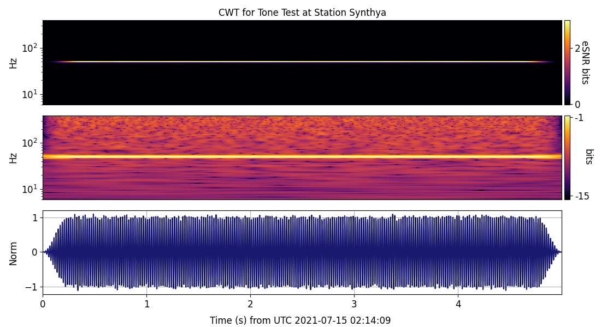
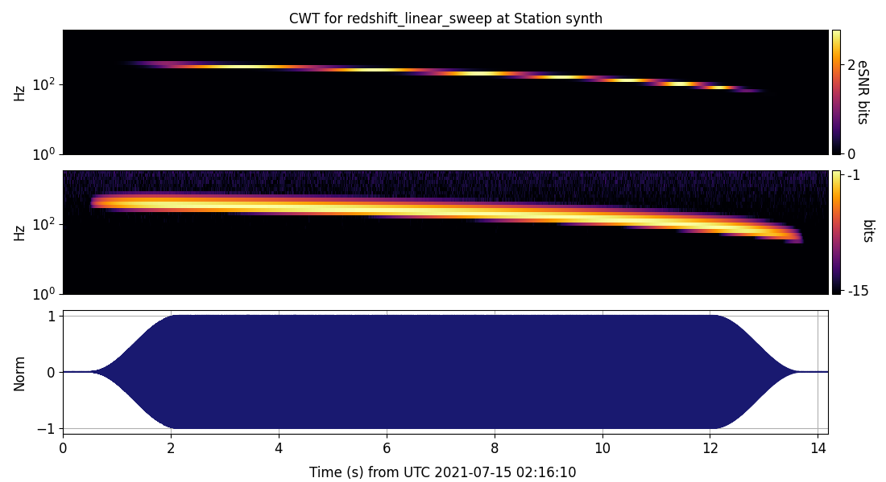
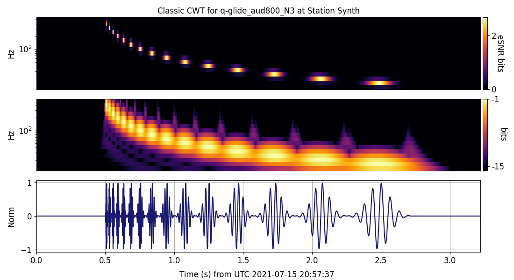

# Examples using libquantum
This section showcases examples using various libquantum modules.

## Table of Contents

<!-- toc -->

- [Blast amplitude check](#blast-amplitude-check)
- [Blast CWT inverse](#blast-cwt-inverse)
- [Tone amplitude check](#tone-amplitude-check)
- [Sweep linear](#sweep-linear)
- [Sweep chirp](#sweep-chirp)
- [libquantum scales and export modules](#libquantum-scales-and-export-modules)


<!-- tocstop -->


### Blast amplitude check

An explosive detonation is the closest acoustic signal we can get to a 
delta function, and in the zeroth (00) example we use the GT pulse to construct a synthetic 
and its time-frequency representations (TFRs).



**To run blast amplitude check example:**

In libquantum, inside examples folder: ```00_blast_amplitude_check.py```.
A copy of the code can be found
 [here](https://github.com/RedVoxInc/libquantum/blob/master/examples/00_blast_amplitude_check.py).

**libquantum modules used**: [atoms](https://redvoxinc.github.io/libquantum/atoms.html),
[entropy](https://redvoxinc.github.io/libquantum/entropy.html),
[scales](https://redvoxinc.github.io/libquantum/scales.html),
[spectra](https://redvoxinc.github.io/libquantum/spectra.html), 
[utils](https://redvoxinc.github.io/libquantum/utils.html), 
[blast_pulse](https://redvoxinc.github.io/libquantum/blast_pulse.html) (as kaboom), 
[plot_templates.plot_time_frequency_reps](https://redvoxinc.github.io/libquantum/plot_templates/plot_time_frequency_reps.html) (as pltq).

Return to _[Table of Contents](#table-of-contents)_.

### Blast CWT inverse

The complex part of the continuous wavelet transform (CWT) 
constructs the Hilbert transform of a real signal, as demonstrated 
in the inverse reconstruction.





**To run blast cwt inverse example:**
In libquantum, inside examples folder: ```01_blast_cwt_inverse.py```.
A copy of the code can be found 
[here](https://github.com/RedVoxInc/libquantum/blob/master/examples/01_blast_cwt_inverse.py).

**libquantum modules used**: [synthetics](https://redvoxinc.github.io/libquantum/synthetics.html) (as synch), 
[blast_pulse](https://redvoxinc.github.io/libquantum/blast_pulse.html) (as kaboom), 
[utils](https://redvoxinc.github.io/libquantum/utils.html), 
[atoms](https://redvoxinc.github.io/libquantum/atoms.html),
[atoms_inverse](https://redvoxinc.github.io/libquantum/atoms_inverse.html).

Return to _[Table of Contents](#table-of-contents)_.

### Tone amplitude check

In the opposite end of delta-type transients, 
we have continuous wave (CW) signals, which include tones.
This example constructs TFR's for a tone.




**To run tone amplitude check example:**
In libquantum, inside examples folder: ```02_tone_amplitude_check.py```.
A copy of the code can be found 
[here](https://github.com/RedVoxInc/libquantum/blob/master/examples/02_tone_amplitude_check.py).

**libquantum modules used**: [atoms](https://redvoxinc.github.io/libquantum/atoms.html),
[entropy](https://redvoxinc.github.io/libquantum/entropy.html), 
[scales](https://redvoxinc.github.io/libquantum/scales.html), 
[spectra](https://redvoxinc.github.io/libquantum/spectra.html), 
[utils](https://redvoxinc.github.io/libquantum/utils.html),
[synthetics](https://redvoxinc.github.io/libquantum/synthetics.html), 
[plot_templates.plot_time_frequency_reps](https://redvoxinc.github.io/libquantum/plot_templates/plot_time_frequency_reps.html) (as pltq).

Return to _[Table of Contents](#table-of-contents)_.

### Sweep linear

Many signals fall between transients and CWs. Sweeps are a recurring type, 
and this example constructs a classic linear sweep and some TFRs.



**To run sweep linear example:**
In libquantum, inside examples folder: ```03_sweep_linear.py```.
A copy of the code can be found 
[here](https://github.com/RedVoxInc/libquantum/blob/master/examples/03_sweep_linear.py).

**libquantum modules used**: 
[atoms](https://redvoxinc.github.io/libquantum/atoms.html), 
[entropy](https://redvoxinc.github.io/libquantum/entropy.html),
[scales](https://redvoxinc.github.io/libquantum/scales.html), 
[spectra](https://redvoxinc.github.io/libquantum/spectra.html), 
[utils](https://redvoxinc.github.io/libquantum/utils.html), 
[synthetics](https://redvoxinc.github.io/libquantum/synthetics.html),
[plot_templates.plot_time_frequency_reps](https://redvoxinc.github.io/libquantum/plot_templates/plot_time_frequency_reps.html) (as pltq).

Return to _[Table of Contents](#table-of-contents)_.

### Sweep chirp

The q-chirp is constructed from sequential constant-Q chirps to build a sweep.
They have interesting properties that highlight chirp applicability.



**To run sweep chirp example:**
In libquantum, inside examples folder: ```04_sweep_chirp.py```.
A copy of the code can be found
 [here](https://github.com/RedVoxInc/libquantum/blob/master/examples/04_sweep_chirp.py).

**libquantum modules used**: 
[atoms](https://redvoxinc.github.io/libquantum/atoms.html), 
[entropy](https://redvoxinc.github.io/libquantum/entropy.html), 
[scales](https://redvoxinc.github.io/libquantum/scales.html), 
[spectra](https://redvoxinc.github.io/libquantum/spectra.html), 
[utils](https://redvoxinc.github.io/libquantum/utils.html), 
[synthetics](https://redvoxinc.github.io/libquantum/synthetics.html),
[plot_templates.plot_time_frequency_reps](https://redvoxinc.github.io/libquantum/plot_templates/plot_time_frequency_reps.html) (as pltq), 
[plot_templates.plot_time_frequency_picks](https://redvoxinc.github.io/libquantum/plot_templates/plot_time_frequency_picks.html) (as pltpk).

Return to _[Table of Contents](#table-of-contents)_.

### libquantum scales and export modules

The scales module constructs standardized scales, such as frequency band scales, that libquantum relies on. 
The export module exports time scales and frequencies to screen. 
We provide some examples that can be easily modified to any time scales
in the known universe.
  
**To run libquantum scales and export example:**
In libquantum, inside examples folder: ```05_using_libquantum_scales.py```.
A copy of the code can be found 
[here](https://github.com/RedVoxInc/libquantum/blob/master/examples/05_using_libquantum_scales.py).

**libquantum modules used**: 
[export](https://redvoxinc.github.io/libquantum/export.html),
[scales](https://redvoxinc.github.io/libquantum/scales.html).

Return to _[Table of Contents](#table-of-contents)_.
